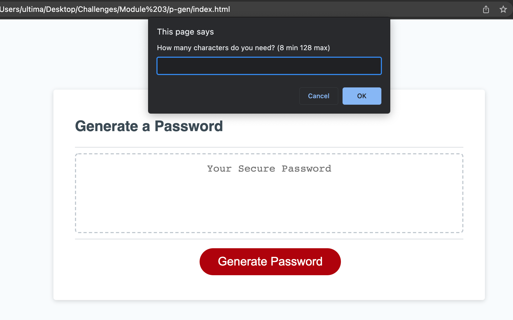
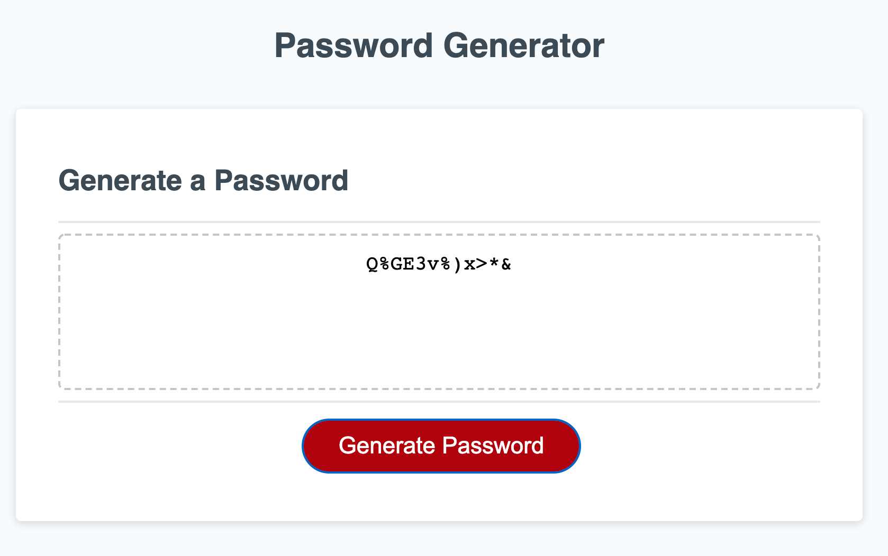

# Password Generator

## Very simple password generator will form a password based on 5 criteria
- length between 8 and 128 characters
- Do you want Capital Letters
- do you want lowercase letters
- do you want numbers
- do you want special characters

the generator will iterate through making a password until your password contains at least 1 of each of your requested characters

### You'll see a series of prompts like this

### When you're done you'll see the password in the box

